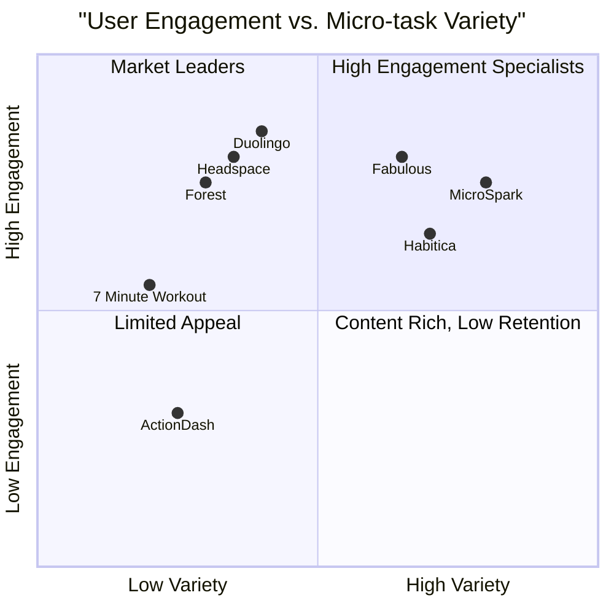

# Product Requirements Document: MicroSpark

**Language**: English (for overseas users)
**Programming Language**: React, JavaScript, Tailwind CSS
**Project Name**: micro_spark

## Original Requirements

Develop an app focused on overseas users called "MicroSpark" (碎片时间挑战器) that helps users make the most of their fragmented free time by suggesting micro-challenges based on available time duration (such as 5-minute speed writing, 10-minute meditation, 3-minute micro-workouts, speed-reading short articles, etc.). The app aims to solve the problem of wasted small pockets of time throughout the day and provides users with a sense of achievement and continuous challenge rewards to enhance user stickiness.

## 1. Product Definition

### 1.1 Product Goals

1. **Time Optimization**: Help users transform idle fragments of time (1-15 minutes) into productive micro-activities that add value to their daily lives.

2. **Habit Formation**: Build positive micro-habits through consistent engagement with quick, achievable challenges tailored to users' interests and available time.

3. **Achievement Tracking**: Create a rewarding system that provides users with tangible evidence of their accomplishments and progress over time.

### 1.2 User Stories

1. **As a busy professional**, I want quick suggested activities that match my available time window so that I can be productive during short breaks between meetings.

2. **As a commuter**, I want easily accessible challenges I can complete on public transport so that my daily travel time feels purposeful and valuable.

3. **As a wellness-focused individual**, I want micro-challenges related to mindfulness and physical health so that I can maintain my wellbeing despite a hectic schedule.

4. **As a skill-builder**, I want bite-sized learning activities so that I can make progress on new skills even when I don't have large blocks of time available.

5. **As an achievement-oriented person**, I want to track my completed micro-challenges so that I can feel a sense of accomplishment from my cumulative efforts.

### 1.3 Competitive Analysis

| Competitor | Description | Pros | Cons |
|------------|-------------|------|------|
| **Fabulous** | Science-based habit formation app | Beautiful design, science-backed routines, comprehensive | Focus on longer routines, overwhelming feature set, subscription-heavy |
| **Forest** | Pomodoro timer that grows virtual trees | Simple concept, visual rewards (trees), social sharing | Limited to time-focused productivity, lacks challenge variety |
| **Habitica** | Gamified habit tracker and to-do list | RPG-style rewards, customizable, social features | Complex learning curve, game elements can distract |
| **Duolingo** | Language learning app with micro-lessons | Excellent streak mechanics, quick lessons, gamification | Single-purpose (language only), sometimes repetitive |
| **7 Minute Workout** | Quick physical exercise routines | Clear time commitment, video guides, focused purpose | Limited to fitness only, lacks personalization |
| **Headspace** | Guided meditation app | High-quality content, progressive system, well-designed | Subscription cost, single-focus on meditation |
| **ActionDash** | Digital wellbeing and screen time app | Usage insights, focus mode, behavior change | Passive tracking rather than active challenges |

### 1.4 Competitive Quadrant Chart

## 2. Technical Specifications

### 2.1 Requirements Analysis

MicroSpark differentiates itself from typical productivity apps by focusing on the specific problem of fragmented time utilization. Rather than simply tracking habits or providing a to-do list, the app dynamically matches micro-activities to users' available pockets of time. The key technical capabilities required include:

1. **Time-Based Challenge Matching System**: Algorithm that suggests appropriate challenges based on available time duration.

2. **User Preference Learning**: System to understand user interests and tailor challenge suggestions accordingly.

3. **Progressive Difficulty Levels**: Challenge complexity that adapts as users build proficiency.

4. **Real-Time Time Tracking**: Accurate timing mechanism with visual and audio feedback.

5. **Achievement Visualization**: Compelling visual representation of user progress and accomplishments.

6. **Offline Functionality**: Core features must work without internet connection for usage during commutes or in areas with poor connectivity.

7. **Localization Framework**: Support for multiple languages and culturally relevant challenges for overseas markets.

8. **Notification System**: Intelligent reminders based on user patterns without becoming intrusive.

### 2.2 Requirements Pool

#### P0 (Must-have)

1. **Time-Based Challenge Recommendation Engine**
   - Algorithm must accurately match challenges to user's specified available time
   - Challenge library must include activities for 1, 3, 5, 10, and 15-minute time slots
   - Users must be able to input available time manually or select from preset options

2. **Core Challenge Categories**
   - Physical activity/stretching
   - Mindfulness/meditation
   - Learning/skill-building
   - Creativity/expression
   - Productivity/organization

3. **Profile & Preferences System**
   - First-time user onboarding to capture interests and preferences
   - Challenge category preferences and difficulty settings
   - Personal challenge history and statistics

4. **Challenge Execution Interface**
   - Clear instructions with minimal text
   - Timer with visual progress indicator
   - Simple completion confirmation mechanism

5. **Achievement Tracking**
   - Daily/weekly/monthly challenge completion metrics
   - Streak tracking for consistent usage
   - Basic badge/reward system for milestones

#### P1 (Should-have)

1. **Personalized Challenge Algorithm**
   - Machine learning component to refine suggestions based on user behavior
   - "Smart scheduling" to suggest optimal challenge times based on usage patterns
   - Challenge variety controls to prevent repetition

2. **Extended Challenge Library**
   - Minimum 50 unique challenges per category
   - Seasonal/themed challenge collections
   - Progressive challenge sequences that build skills over time

3. **Social Features**
   - Challenge sharing functionality
   - Optional community leaderboards
   - Challenge creation and submission by community

4. **Advanced Analytics**
   - Time utilization insights and patterns
   - Category preference analysis
   - Progress visualization across different challenge types

5. **Offline Mode Enhancements**
   - Downloaded challenge packs for offline use
   - Background synchronization when connectivity resumes

#### P2 (Nice-to-have)

1. **Smart Device Integration**
   - Smartwatch app for challenge notifications and simple challenges
   - Integration with fitness trackers for physical challenge verification
   - Smart home integration for environment optimization (lights, music)

2. **Premium Content Partnerships**
   - Branded challenges from recognized experts in various fields
   - Exclusive challenge content from partner companies
   - Premium challenge bundles available via subscription

3. **Challenge Customization Studio**
   - Tools for users to create personalized challenge templates
   - Challenge scheduling and sequencing
   - Custom challenge sharing with friends

4. **Advanced Gamification**
   - Virtual currency earned through challenge completion
   - Digital collectibles and customization options
   - "Challenge Journeys" that tell a story across multiple micro-activities

5. **Academic Research Integration**
   - Anonymized data sharing options for productivity research
   - Scientifically validated challenge efficacy metrics
   - Partnerships with universities for productivity studies

### 2.3 UI Design Draft

#### Key Screens

1. **Home/Dashboard**
   - Time selection slider (1-15 minutes)
   - "What can I do now?" prominent button
   - Quick access to favorite/recent challenges
   - Daily challenge streak indicator
   - Activity category quick filters

2. **Challenge Suggestion Screen**
   - Card-based layout of 3-5 challenge options matching time criteria
   - Visual indicator for challenge category (icon-based)
   - Time required prominently displayed
   - Difficulty indicator
   - Brief one-line description
   - "Start Now" button

3. **Active Challenge Screen**
   - Minimalist interface with large timer countdown
   - Clear challenge instructions (visual where possible)
   - Progress steps if multi-step challenge
   - Pause option (with limitation message)
   - Completion button

4. **Achievement Hub**
   - Visual calendar heat map of daily activity
   - Statistic cards for total time utilized
   - Badge collection display
   - Challenge category distribution chart
   - Longest streaks and records

5. **Profile & Settings**
   - User preference controls
   - Challenge category toggles
   - Notification settings
   - Theme/appearance options
   - Social sharing preferences
   - Data usage controls

#### UI Design Principles

- **Glanceable Information**: All critical information must be understandable within 3 seconds
- **One-Handed Operation**: Core functions must be accessible with single-hand thumb operation
- **Motion Design**: Subtle animations to provide feedback and engagement without distraction
- **Color Psychology**: Use of energizing colors for physical challenges, calming tones for mindfulness activities
- **Accelerated Mobile Pages**: Fast loading times and efficient rendering for quick engagement

### 2.4 Open Questions

1. **Content Creation Strategy**: How will we maintain a fresh supply of challenges that remain engaging over time? Will we need a content team or could we implement user-generated challenges with moderation?

2. **Monetization Approach**: What model best balances user value and business sustainability? Options include: premium challenge packs, subscription for advanced features, partnerships with content creators, or non-intrusive advertising.

3. **Privacy Implications**: How do we balance personalization needs with data privacy, especially for users in regions with strict regulations like GDPR?

4. **Engagement Measurement**: Beyond app opens and challenge completions, what metrics will truly indicate if users are building valuable habits?

5. **Offline Capability Extent**: How robust should offline functionality be, considering the storage limitations of mobile devices?

## 3. Market Analysis

### 3.1 Target Market

The primary target market consists of busy, achievement-oriented individuals who:

- **Value efficiency** and are conscious about their time usage
- Are **digitally native**, primarily aged 25-40
- Have **fragmented schedules** with multiple small breaks throughout the day
- Are **growth-oriented** and interested in continuous self-improvement
- Experience **app fatigue** from overly complex productivity solutions

Key overseas markets with high potential include:

1. **North America**: High smartphone penetration, productivity-focused culture
2. **Europe**: Work-life balance awareness, mobile-first consumers
3. **Asia Pacific**: Large mobile-first population, growth in productivity app adoption 
4. **Oceania**: Early adopters of wellness and productivity technologies

### 3.2 Market Trends

- **Micro-Learning Growth**: The micro-learning market is projected to grow at a CAGR of 13.2% until 2028
- **Time Fragmentation**: Average attention spans have decreased to 47 seconds on mobile devices
- **Achievement-Based Motivation**: 73% of productivity app users cite visible progress as a key factor in continued usage
- **Mindfulness Focus**: 36% increase in mindfulness app downloads over the past year
- **Subscription Fatigue**: Growing resistance to multiple subscription services

## 4. Development Roadmap

### 4.1 Phase 1: MVP Release (3 months)

- Core challenge recommendation engine
- Initial library of 100+ challenges across 5 categories
- Basic profile and achievement tracking
- Fundamental onboarding and preference settings
- Analytics foundation for user behavior insights

### 4.2 Phase 2: Engagement Enhancement (3 months post-launch)

- Machine learning implementation for improved recommendations
- Expanded challenge library (200+ additional challenges)
- Social sharing functionality
- Enhanced achievement visualization
- First premium features introduction

### 4.3 Phase 3: Ecosystem Expansion (6 months post-launch)

- API for third-party challenge creators
- Smart device integration
- Advanced offline capabilities
- Regional localization for top 5 overseas markets
- Community features and user-generated content

## 5. Success Metrics

### 5.1 User Engagement

- **Daily Active Users (DAU)**: Target of 40% of installed user base
- **Challenge Completion Rate**: >70% of started challenges completed
- **Session Frequency**: Average 3.5 sessions per user per day
- **Session Duration**: Average combined daily usage of 18-25 minutes
- **Day 30 Retention**: Target of 35%+ (industry benchmark: 15-25%)

### 5.2 Business Metrics

- **User Acquisition Cost**: Under $2.50 per active user
- **Lifetime Value (LTV)**: Minimum $15 per active user
- **Revenue Growth**: 15% month-over-month in first year
- **Conversion Rate**: 5-8% free to premium conversion

## 6. Final Considerations

The MicroSpark app addresses a universal pain point—the inefficient use of small pockets of time—with a solution that is both practical and psychologically rewarding. By focusing on micro-achievements and gradual habit building, the app has the potential to create meaningful behavior change while avoiding the overwhelm common to many productivity tools.

The key to success will be balancing simplicity with depth: the interface must be instantly comprehensible and require minimal interaction to begin a challenge, while the underlying system needs to be sophisticated enough to deliver personalized, varied content that keeps users engaged over time.

Unlike traditional to-do list apps that often become sources of guilt or pressure, MicroSpark positions itself as an opportunity-focused tool that helps users feel good about small accomplishments rather than overwhelmed by incomplete tasks.